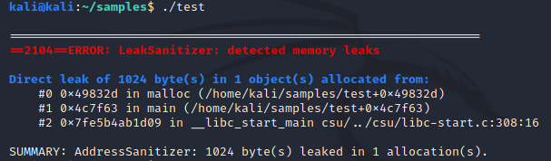
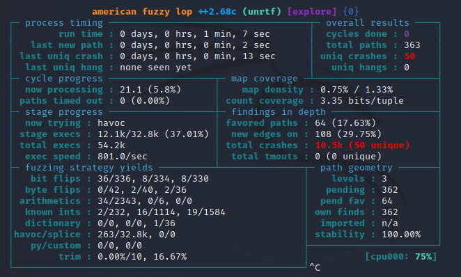
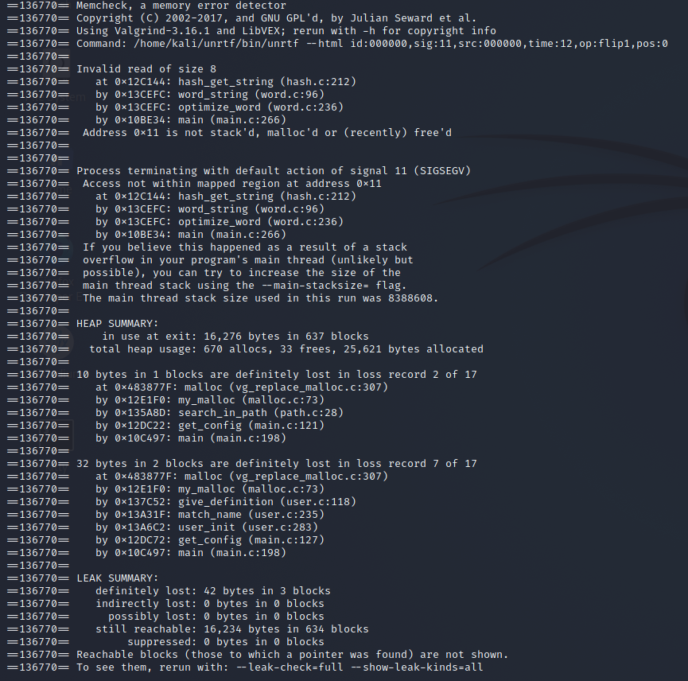
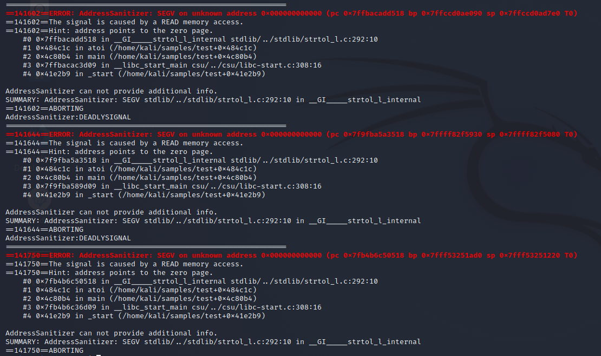
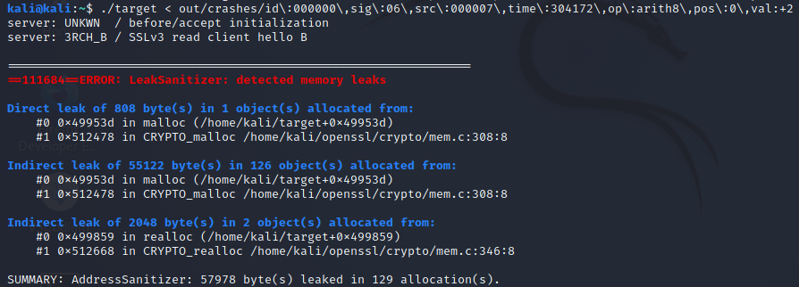
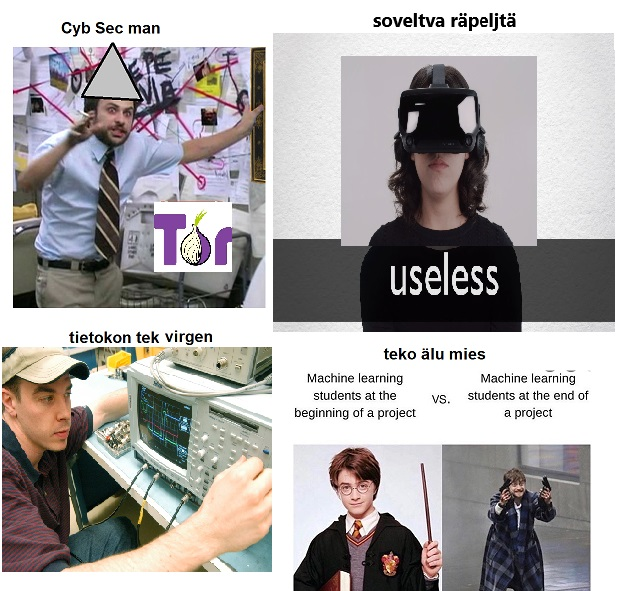
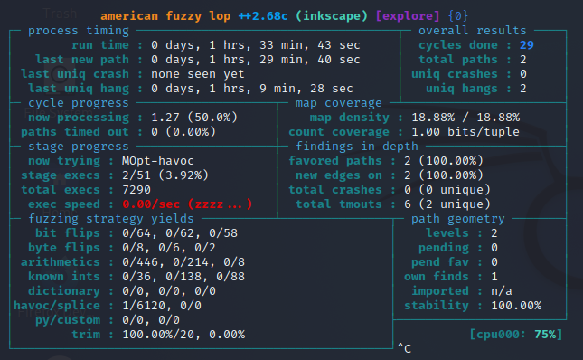

# Lab 1: Fuzzing

## Task 1.
### 1.1

```
echo "Fuzztest 1337" | radamsa -n 10

Fuzzt 0317

F$PATH'xcalc\x00;xcalc\raaaa%naaaa%d%n$(xcalc)%nNaN!!$+%d\x00\r%p!!!!&#000;Fuzztest 1337$1NaN$

(xa)Fuzztest 1337$1NaN$(xa)Fuzztest 1337

Fuzztest 1337

Fuzztest!290

Fuzztest 170141183460469231731687303715884105727

Fuzztest 340282366920938463463374607431768211456

Fuzztest 4294967297

Fuzzte$+$
+\r\n\u0000\r\0`xcalc`!xcalc\x9223372036854775809a\r%saaaa%d%n!xcalc'xcalcst�170141183460469231731687303715884105729

Fuzztest�91856
```

### 1.2
content of fuzz41.txt

>1 EF

content of fuzz 76.txt

>1 E��1 E����������������������F

command

> for i in `seq 1 100`; do radamsa sample.txt > fuzz$i.txt; done  

&nbsp;

---  


## Task 2.

### A)

Compile
> clang -fsanitize=address -O1 -fno-omit-frame-pointer sample.c -o test

Screenshot of the error



The error is a memory leak, caused by the program not freeing the allocated memory.

### B)

Configuring unrtf

> ./configure CC="/usr/bin/afl-gcc" --prefix=$HOME/unrtf

Command line used to run AFL

> afl-fuzz -i input/ -o output/ ~/unrtf/bin/unrtf 

Screenshot of status screen



The important parts of the status screen are the fuzzing strategy yields, overall results and the stability of the program. 

Looking at the fuzzing strategy yields and their numbers it is possible to make out what exactly are the weakest links of the program. In this case we can see that bit flips have the best ratio out of any other choice, but that does not mean the other results should not be taken into consideration when considering possible security risks. The yields just serve as a good pointer on where to start looking.

The stability is another important factor, considering it measures the programs output when given the same input. If this number starts dropping there are not only security issues to consider, but a lot of possible program faults to think about.

### C)

&nbsp;



The crash is caused by the program performing an invalid memory access. The function which crashes is "hash_get_string" in hash.c file. From reading the code involved, I think the crash is caused by the the program reading the file input, which by having garbage data hashed causes the function to try to reach for wrong memory address. 


&nbsp;

---

## Task 3.

For the code please check out test.c. Below you can also checkout the screenshot of the ASAN outputs. 



&nbsp;

---

## Task 4.

CVE-2014-0160 is also better known as Heartbleed.

The leak happens because of an indirect memory leak in the cryptographic allocation functions. This allows the attacker to read more data than should have been possible.



&nbsp;

---

## Task 5.

For this task the target software chosen was [Inkscape](https://inkscape.org/), a vector graphics editor. The program has great coverage of multiple input types and plenty of different functions that can be fuzzed. Inkscape uses a whole heap of different libraries, so many in fact that the test VM took almost one and a half hour just to build the program, even with the fast build option.

The fuzzer used was the AFL-Fuzz used in the other tasks. The fuzzer files used was a funny picture made by myself and a friend. The version of Inkscape that was in use was Inkscape 1.3-dev (9bb0dc3846, 2022-07-20). The virtual machine used for testing is the course machine. 



The part of the program that was fuzzed was Inkscapes export part where you could export a picture of one type to another. In this case the exporting was from jpg file to png. The fuzzing itself was very slow due to the nature of the program. I left the fuzzer on for around an hour and half and with no crashes, but two unique timeouts, I decided that it was good enough. Pictured below is the final screen of AFL.




