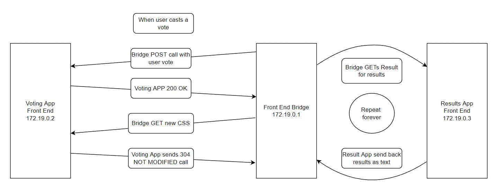
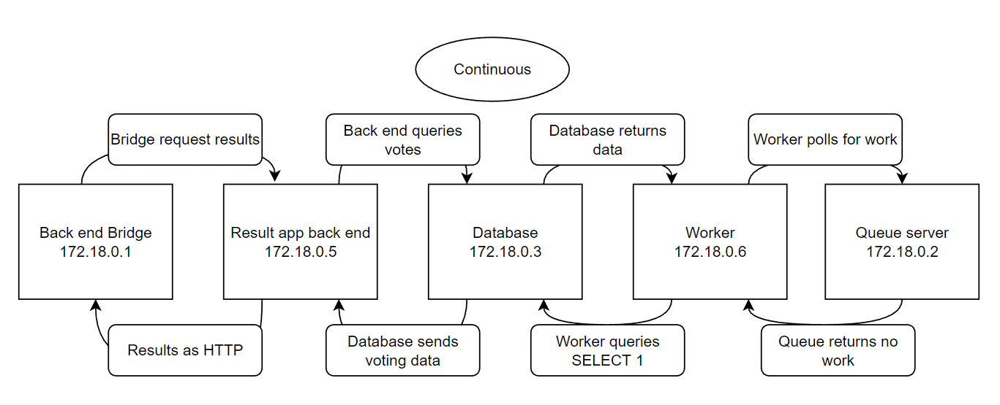
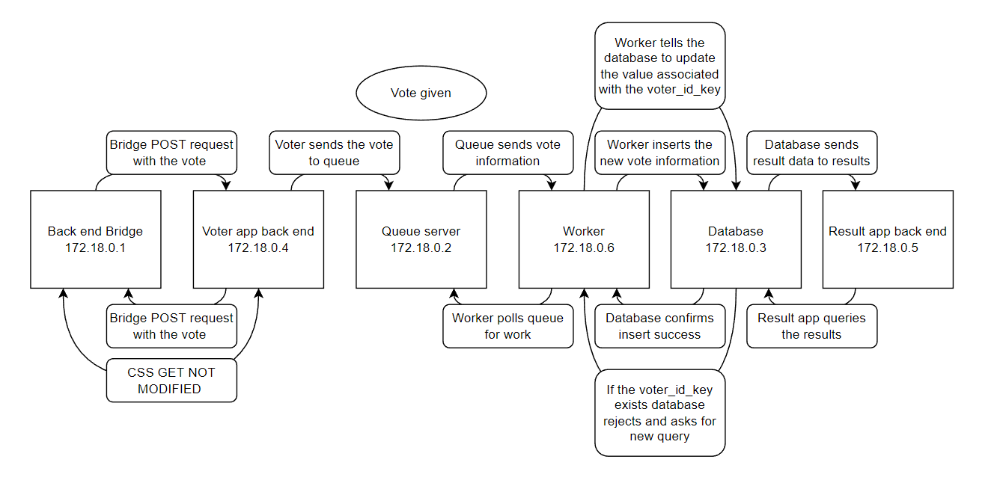
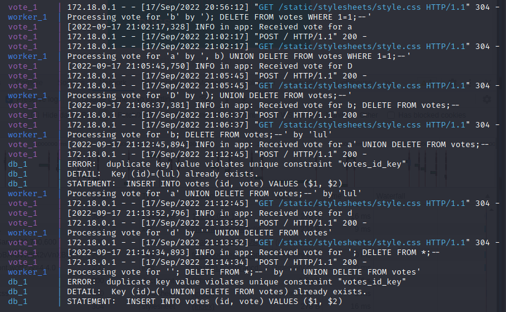

# Lab 2: Networks and web security

## Instructions

Below is a copy of the questions found in the Network lab folder. Answer the questions here. In task 3 put the server code and the XSS-script to a different file. Also the picture and the report in task 4 can be returned as a separe files.

Note that there is reserved folder for specific tasks.

## Task 1
## Basic SQL Injections

### Errors

The query used to cause a searh was q='juice'. This caused an syntax error that happened due to the single quotes closing a statement earlier than expected. This gap can be exploited for SQL injection.

```SQL
SELECT * FROM Products WHERE ((name LIKE '%SEARCHRESULT%' OR description LIKE '%SEARCHRESULT%') AND deletedAt IS NULL) ORDER BY name"
```

### Deleted item!

Items are deleted by checking whether or not the deletedAt column is NULL. Getting all the items is as simple as stopping the above command short by commenting out the rest of the query, so that the SQL looks like this.

```SQL
SELECT * FROM Products WHERE ((name LIKE '%'))--SEARCHRESULT%' OR description LIKE '%SEARCHRESULT%') AND deletedAt IS NULL) ORDER BY name"
```

This works due to the SQL query being complete and the rest of the query being a comment that the SQL server ignores.

### Concrete Error

By applying different kinds of SQL injections to the login fields, it is possible to see that the query going to the SQL server in this case is 

```SQL
SELECT * FROM Users WHERE email = 'EMAIL' AND password = 'PASSWORD' AND deletedAt IS NULL
```
This is the SQL command we want to break by injecting. If the email field is injected with the following "' OR 1=1 --", the command morphs into 
```SQL
SELECT * FROM Users WHERE email = '' OR 1=1 --' OR AND password = 'PASSWORD' AND deletedAt IS NULL
```
As can be seen this makes it so that the query returns a user with the email '' or the first user in the table. Obviously no user with '' email exists, so the query returns the first user in the table Users, which happens to be the admin.

Alternatively, it is possible to checkout the reviews on the site and see that the email address of the admin is admin@juice-sh.op. This can be used in a targeted attack by making the email field the following "admin@juice-sh.op'--". Again this makes the query
```SQL
SELECT * FROM Users WHERE email = 'admin@juice-sh.op'--' OR AND password = 'PASSWORD' AND deletedAt IS NULL
```
and this logs us in as the user with the admins email, which happens to be the admin.

## Inspecting the client resources

### Scoreboard

Using the developer tools it is possible to open the main.js of the site. Upon closer inspection of the main.js we can find references to the Scoreboard as "scoreBoard" and "score-board". Trying to access localhost:3000/#/score-board nets us access to the actual score board.

### Administration panel

Doing the same as above, we can find references to "administration". Accessing localhost:3000/#/adminitration while logged in as the admin gives us the administration panel.

## XSS attacks

### Pop-up

DOM based XSS modifies the users environment, without making any changes to the server itself. The HTTP is unchanged, but the users client side changes due to the script. For the reflected attack, the attack bounces back from the server. If a trusted user for example clicks a link that has XSS attack in it, the server trusts the users link and bounces that back to the user as a response where the XSS can then execute.

### Persistent XSS

The server should validate inputs on both client and server-side, and all variables should be sanitized or escaped.

## Task 2 

**'These are not my credentials'**

SQL command
 ```sql
 ' AND 1=2 )) UNION SELECT id, username, email, password, createdAt, updatedAt, deletedAt, password FROM Users--

```

In SQL the UNION operator combines two or more SELECT statements. Thanks to that, it is possible to inject another SELECT command from a different table within the one before, if the field isn't sanitized. The problem for the attacker comes from not knowing how many columns are required for the information to register, but this can be found out by a select number of methods. If the server accepts the command, UNION modifier combines the two results, even if that includes data from tables where the attacker shouldn't be able to access. Adding 1=2 false statement at the end of the original query makes it so that all data that returns pertains to the new injection.


---
**Cross-site request forgery**


* [index.html](./Task2_CSRF/index.html)

---

**Brute forcing**

* [Wordlist](./Task2_Brute_force/wordlist.json)
* [Any code you created](./Task2_Brute_force/)


Wordlist was created by making a [Python Program](./Task2_Brute_force/mutator.py) that generated all the possible permutations of 'vaapukkamehu'. Then I wrote a [brute attacker](./Task2_Brute_force/Brute.py) for the server program. Unfortunately, the brute was very sluggish, as a single post request took nearly two seconds to complete. So I made a [brute](./Task2_Brute_force/Brute2.py) that attacked from the opposite side of the wordlist that was created. 10000 permutation with 1 permutation gone through in two seconds is still a way way too long time. So I made [more](./Task2_Brute_force/brutish.py) [brutes](./Task2_Brute_force/brutish2.py). Finally with their help we were able to get to the answer, even if it still took way too long.

---

## Task 3

* Server code can be found in [here](./Task3/app.py).
* HTML can be found over [here](./Task3/main.html).
* And the zip is right [here](./Task3/exploit.zip).
* And finally, the hopefully clear instructions are [there](./Task3/README.md).
---

## Task 4

### Getting the network

The docker container sets up end points in multiple places. The documentation of the voting app says that the end points can be found in localhost:5000 for the voting site and localhost:5001 for the result site. The docker CLI itself says that there is also one end point at 172.18.0.1. Running docker ls and then requesting information from the docker also shows that there is a front end running at 172.19.0.0.

Running nmap (or asking docker for back end network) for 172.18.0.0 shows that there are actually six networks for 172.18.0.0. These are the bridge for docker at 172.18.0.1, queue at 172.18.0.2, database at 172.18.0.3, voting app backend at 172.18.0.4, result app backend at 172.18.0.5 and then the queue and database worker at 172.18.0.6.

Continuing with the nmap (or again asking docker about the front end network) and scanning 172.19.0.0 shows three networks located at that point. 172.19.0.1 is the bridge for docker, 172.19.0.2 is the voting app front end and 172.19.0.3 is the result front end.

Using wireshark to analyze both front and back end network traffic gave easily enough infromation to build the diagram.

Below is the front end data flow diagram, without the SYN, ACK and FIN ACK calls. For a more detailed flow of data, check the dropdown below.



<details>
<summary>Frontend docker container network cycle:</summary>
<br>

Bridge polls result site with GET -> Results site ACKnowledges GET -> Result site returns results in plaintext -> Bridge polls again after getting results -> repeat ad nauseam.

User casts a vote -> Bridge and Voting app make SYN acknowledgments -> Bridge ACK SYN calls -> POST request sent from bridge to voting app -> voting app ACKs -> voting app sends a 200 OK call to bridge -> bridge ACKs -> both make FIN ACKs -> Bridge calls voting app again with SYN -> voting app SYN -> bridge ACK -> bridge GETs a new CSS from voting app -> voting app ACKs then sends a 304 NOT MODIFIED call to bridge -> bridge ACKs -> both send FIN ACKs

</details>

For the backend there are two different cycles, one that is going on continuously and one when a vote is given. The first diagram shows the continuous polling cycle, while the other shows the data movement after a vote is given.





These are again without the accompanying SYN, ACK and FIN ACK calls. You can find more details in the below dropdown.

<details>
<summary>Backend network cycle:</summary>
<br>

Worker located at 172.18.0.6 contacts queue server located at 172.18.0.2 for work -> If no work Worker still asks for SELECT 1 from the database -> database returns data -> Worker again contacts the queue server -> repeat.

Bridge sends a request to result back end -> Result back end at 172.18.0.5 contacts the database with vote query -> Database responds with the current vote results -> Result end sends the information over to bridge located at 172.18.0.1 over HTTP -> Bridge again requests -> Repeat

User casts a vote -> Bridge contacts the voting network -> SYN -> Bridge posts a POST request with vote -> voter ACKs -> voter contacts queue -> both have a lot of ACKs -> voting app sends the HTML over to the bridge -> the CSS 304 NOT MODIFIED thing also happens skipping this over because it is detailed in front end already -> worker polls queue for work -> new work located, worker asks database to insert new data -> database does so, informs the worker -> worker happily ACKs -> the new database information goes to the voting service when it polls the database

If the voter_id_key is already in use
worker asks database to insert new data -> database tells worker that the votes_id_key used by the data already exists and sends a new command request -> worker ACKs and asks the DB to change the value of vote which has the used ID -> database changes the data for the ID -> worker ACKs -> continues as normal

</details>

As a security test I used burpsuite to modify the sent vote. As the votes were sent as *a* or *b*, I tried sending *c* and *d* and different numbers. I looked at the wireshark to see what happened and to my surprise, the queue passed on the values to the worker, who sent them to the server and the server accepted all values. 

From this viewpoint I tried to do some SQL injections to the database. Since the command that the worker polls the database with is 
```SQL
INSERT INTO votes (id, vote) VALUES ($1, $2)
```
I tried multiple different takes on the following injection. 
```SQL
b") UNION DELETE FROM votes WHERE 1=1;--
```
but unfortunately nothing worked. 

Then I turned my attention towards the cookie voter_id which was also sent to the database. I was also unsuccesful at turning this cookie into an injection point. See the image below. 




