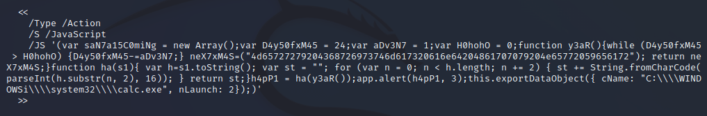
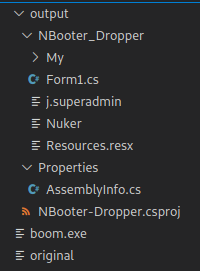

# Lab 3: Botnets

## Task 1: 

Running the files through clamscan with *clamscan <Filenames>*, we get no matches. 

Running clamav using cincan nets the same result. 

Running Yara by using command 

```console
cincan run cincan/yara -w  "/rules/index.yar" <FILE>
```

on all files nets the following.

For the doc files we get signatures of Visual Basic Macros and what's more alarming is the AutoOpen_Macro signature that wil automatically upon opening up run an unkown macro command. While these do not instantly mean they are malicious, it is something to consider.


For the PDF files we get two different signatures. Example.pdf has invalid_trailer_structure and js_wrong_version signatures.


Finally.pdf on the other hand has Big_Numbers1 signature (this can also be seen on one of the doc files) and multiple_versions signature.


Running thhe files through virustotal check we have some matches. 

Example.pdf is flagged as a trojan that has been blocked by multiple engines. It contains javascript that can be used to execute unwanted commands. Same goes for uncompatible.doc, as it is also flagged as a trojan hiding poweshell commands.

Both finally.pdf and videos.doc are not flagges as malicious files, but they seem to be blocked by multiple engines.


### A) Have files been identified already? Do we find some malicious files based on these tools? Even if there are malicious files, why might they not appear there? What is the disadvantage of using signature-based identification?

Yes, as told above all files have been identified and they all have been flagged by multiple engines as potentially malicious files. On the other hand, based on the values given by clamav they would all be clear, but adding the yara signatures found makes them suspicious at least. 

Even if the files are not flagged as definitely malicious, they might still be malicious simply because the signature has not yet been caught. Signature-based identification requires the signature to have been found already, so if the attack is a new one, the signature is still unknown.

### B) What is the worst thing you can do with a suspicious Microsoft Office document? (Disabled by default) 

OFfice documents allow attackers to execute command line scripts, and this can be used to commit very grave attacks using trojans or viruses. For example, one attack using a known vulnerability managed to shutdown three power distributions in Western Ukraine.

### C) Malicious PDF files are also common. How are they usually infecting the machine of the potential victim?

Malicious PDF files usually contain embedded code that executes when the user opens the file. JavaScript code attacks are the most common type of embedded coding attacks.

### D) One of the PDF and .doc files is "malicious". Which files might seem to do something abnormal? What do they attempt to do on a general level? Are they executing some code? Include code. Include also the suspicious keywords of PDF.

Running pdfid on both pdf-files nets the following.


As can be seen example.pdf contains one JavaScript object. By running pdf-parses we can see this script in person.



The javascript upon execution will try to access Windows system32 folder and launch the calculator. While this definitely isn't dangerous, it could be replaced with a much more dangerous command. The other PDF file contains nothing of interest at least on a quick skim.

Looking at the Windows outputs using *olevba*, there are some definite results when looking at uncomptaible.doc. 


There are multiple suspicious keywords related to the file, like AutoOpen, poweshell and executable names. But we can also simply see what the macro does, and well it prints some hacker words and then opens the calculator. Very hackerish behaviour. 

On the other hand, the other file contains basically nothing of note. There is one macro included that executes on open, but as we can see it does nothing bad.


## Task 2:

First I analyzed the **Your_great_reward_is_here.eml** using *eml_parser*. The email itself didn't really give much so then using the eml_parser like so

```terminal
cincan run cincan/eml_parser -e . Your_great_reward_is_here.eml
```
to get the attached zip file from the email. 

Zip files are already dangerous to open, so looking inside before doing anything else came first. 

```terminal
unzip -l ClaimThePrice.zip
```

Above command provides the information that there is one file called **ClaimThePrice.doc** inside the zip. Well it doesn't seem to be a zip bomb, so unzipping the zip file might not be too dangerous, and in fact required to analyze the file properly, but before that the *vipermonkey* tool allows analyzing of files inside a zip, so why not use that.

Unfortunately, I was not able to do this with vipermonkey as it was not able to open the file inside the zip, but this was most likely user error.


Well nothing to do but extract the document and get to work. After extraction and running the following command 

```terminal
cincan run cincan/vipermonkey ClaimThePrice.doc
```

This properly starts the program and we get plenty of interesting information.


As can be seen the doc file tries to open up a file for the admin user named **have_fun.ps1**. vipermonkey conveniently stored this file inside an artifacts folder where we can look at it.There are also shellfunctions being executed, but it seems the commands themselves are obfuscated. 

Let's have a look at the ps1 file.

```terminal
kali@kali:~/Documents$ cat ClaimThePrice.doc_artifacts/have_fun.ps1 
[IO.File]::WriteAllBytes([Environment]::GetFolderPath('ApplicationData') + '\treeOrnamenter.exe', [Convert]::FromBase64String([IO.File]::ReadAllText([Environment]::GetFolderPath('ApplicationData') + '\tree.txt')))
```
The powershell script tries to access ApplicationData folder and do something with a treeOrnamenter.exe file while also using a tree.text file. This still isn't too much to go on, but for now we know the file is dangerous and should tell the boss to not to open it. There are no millions here.

Using either *vipermonkey* or *oletools olevba* it is possible to look at and extract the macros used. There is one large macro that uses private function, but it is heavily obfuscated, at least to the untrained eye. I tried unobfuscating it by hand, and the results can be found [here](./src/DONTTOUCH.vb), but this still doesn't tell me much and neither will this macro compile by itself.

But there are some interesting tidbits in the file. For example

```
wayOfSanta = CStr(Environ(funkyfunc(Array(45, 62, 30, 10, 23, 24, 20), 0)) & funkyfunc(Array(18, 56, 54, 20, 17, 127, 5, 73, 63), 445))
Set oFile = fso.CreateTextFile(wayOfSanta)
```

```
claus = CStr(Environ(funkyfunc(Array(45, 62, 30, 10, 23, 24, 20), 0)) & funkyfunc(Array(15, 37, 17, 34, 15, 18, 16, 39, 6, 95, 49, 66, 80), 432))
Open claus For Output As #1
```

These both statements have to do with files, and not only that but the first part of the CStr parts are the same.

Analyzing the doc further with oledump we see the following.


Here we can see two VBA macros in sections 8 and 9. Interestingly we also see three sections with large amounts of data. Analyzing these sections the section three proves most interesting as the string dump of it looks like it is base64. 

Grabbing the text and decoding it with base64 command gives out a lot of interesting text. Saving this to a file and then checking its type we see that it is an executable! We have most likely found the already mentioned **TreeOrnamenter.exe**.

Examining the file further with *ilspy* we get to see the code inside in full. This code can be seen [here](./src/insides_of_exe). Looking at the code, we see some base64 again. Decrypting this we get that the file tries to download a file called **boom_encrypted** from ouspg github. After that the file seems to create file called **evil.exe**. After that I believe it encrypts itself to make sure it will stick in the system, or at least removing it is much harder. There is also something more involving *LimeLoad*. Also it downloads the below file from reddit.


Words to live by.

Finally let's turn our attention to boom_encrypted, the one file downloaded by the by the script. Obviously this file is encrypted, and next we have to figure out how to decrypt it. Looking at the source code of the exe we got before, we can see these two interesting points. 

```C#
byte[] iV = StringToByteArray("222503488E34D554B0FEC555FA4A9569");
byte[] key = StringToByteArray("B672EA3A555CB91998DE696C2304E4DF464765396E7D9D4CF6BA65ECB7E1324C");
```

Reading the source code further we can see that these are used to decrypt the downloaded file using AES CBC decryption. Since the key is 32-bytes long, the file must have been ecnrypted using AES-256-CBC. Now we know how to decrypt the file using the following command.

```terminal
openssl enc -d -K B672EA3A555CB91998DE696C2304E4DF464765396E7D9D4CF6BA65ECB7E1324C -iv 222503488E34D554B0FEC555FA4A9569 -aes-256-cbc -in boom.encrypted > boom
```

The file gotten from this is in base64 format so decrypting it using *base64* command we get a new file. Running *file* command on this nets us the following.


Finally we got to the bottom of this. Onto task 3 we go.

<details>
<summary>Funny thing:</summary>

Did you know that googling treeornamenter.exe returns exactly one [website](https://vms.drweb.com/virus/?i=21764724). Here we can see some relevant information like  what the virus does and so on.

</details>

## Task 3:

We will now call **boom.decrypted boom.exe** for the sake of convenience. Running ilspy on this file is possible and it gives out source code for a file that's named **NBooter_Dropper**. **Nbooter_Dropper** connects to *nbooter.net* website. ***DoTheTricks()*** function creates two programs **logonsvc.exe** and **msqlite.exe**. It the connects to the *nbooter.net* with a command that uses a random string of letters and numbers, the users username and computer path, internet speed and a hardcoded key.

```terminal
cincan run cincan/ilspy boom.exe
cincan run cincan/ilspy -p -o output boom.exe
```

This gives out all the files included in the project. Checking them out most are CS files, except for one *Resources.resx* file. Opening this up with vim shows that it is an absolutely massive file with over 30 000 lines of code, yet most of it is encoded in base64. Stripping the file of unneccessary lines and trying to convert it doesn't work. Upon closer look in Visual Studio Codium, the files are actually two different files. Separating these into two files gives out two new files, **Nuker** and **j.superadmin**.



**j.superadmin** is the bot controller. It downloads and setups a file from the *nbooter.net*. The application it installs is most likely a bot, simply because it calls the files so.

**Nuker** is a set of DoS tools. There are plenty of different sets of tools inside the application. Running the application inside a Windows Sandbox gets this. 


After the secret password the whole GUI reveals itself.


The nuker contains multiple variants of attacking, ranging from low to starburst. What the attacks do are send tons of calls to a server, in hopes of crashing it or slowing it down for other users. Some attacks can consist of nothing but empty queries, while others might contain lots of garbage. Attack methods can be UDP, TCP, TCPCON, ping, rudy, HTTP, D-Flood and CH. 


UDP attacks send large amoounts of UDP packets to the target, causing it to get overwhelmed. RUDY and HTTP attacks send out legitimate headers that tell the target that there will be a very large POST request that gets sent over to the target at an incredibly slow rate. Because the target believes that there is an actual message incoming it will stay and wait for the data to come over. TCP attacks utilize the three step handshake of the protocol to make, by sending a SYN call to the target but never responding again. The server will wait for the handshake ACK call, and if this is done on multiple address the target system can slow down.

I tried running all three exes inside a Windows Sandbox with the Defender turned off and Wireshark running to hopefully capture some of the packets being sent to the *nbooter.net*, but nothing happened, at least visually. I didn't see any suspicious activity in the task manager either nor on wireshark. *nbooter.net* is a dead domain so perhaps the tasks die without a connection.

## Task 4:

Make step-by-step report (what, why and how) for what you did. Include possible source and configuration files as well.
