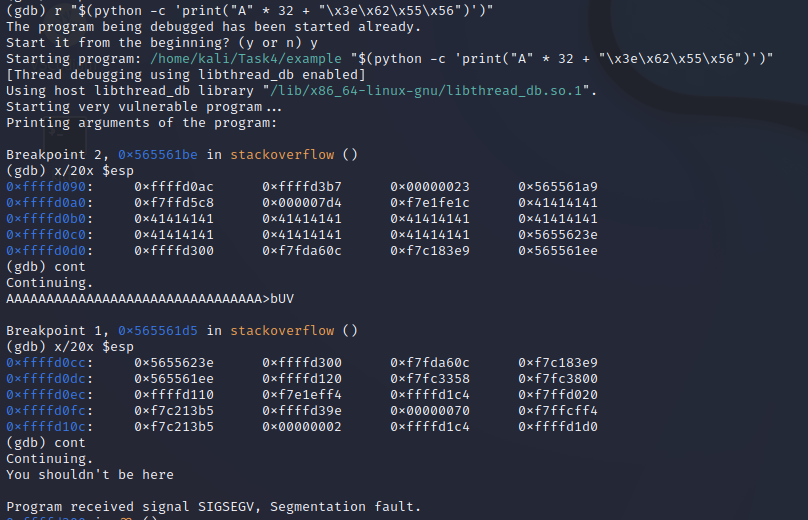

# Lab 4: Shellcoding

## Task 1 : Basics of buffer overflows

### A) Using program with improper input validation and analyzing overflow

* What is the role of the rip (instruction pointer) register and ret instruction?

**rip** register is a special-purpose register that holds the memory address of the next instruction to execute in the program. **ret** instruction transfers program control to a return address located on top of the stack. If the **rip** register can be overflown with another memory address, rather than the programs wanted one, **ret** command will transfer control of the program to that memory address. 

* What is causing the buffer overflow? (Why it is happening?)

Reading the sourcecode, the function takes in a CLI argument to parse that it then gives to the function *stackoverflow*. The function defines itself a buffer of 20 bytes to be used to store the incoming character string. No checking is done to ensure that the incoming string is larger than that nor is the buffer dynamically allocated, which causes the function to overflow when the given argument is copied into the buffer, if the argument is larger than 20 bytes.

* Provide a screenshot and command of situation, where you managed to reach instruction pointer register, when adding only **one byte** into this register.

Testing was done on both a 32-bit and 64-bit programs. 


***For the 32-bit program***

Running the program with only 20 A letters and using breakpoints after the program reads the arg and before returning, it is possible to see what goes on inside the registeries.


As can be seen, there is some overflow happening, but not enough to reach the instruction pointer. With 20 A letters, five registeries are full of A letters, but there are still three registeries before the instruction pointer register. Simple calculation gives the answer of 33 A letters to overflow one byte of the instruction pointer register.


Success!

***For the 64-bit program:***

Here can be seen that the registers do overflow when adding 20 "A" letters into the program argument, but not enough to reach the instruction pointer. 


Since 20 A letters take the space of five memory registers, and there are still five registers to go before reaching the instruction register. With simple math the amount of A letters required to overflow the instruction register would be 41 A letters. Testing it out the results are the following.


Success!

### B) Adding hidden (non-used) function to previous program. (And still executing it)

* Show your new function here as code snippet:

    ```c
    int secret(){
        printf("You shouldn't be here\n");
        return 1;
    }
    ```

***For the 32-bit program:***

First by disassembling the secret function, its first memory register can be seen. In this case it is **0x5655623e**. Using a breakpoint at the return call for the *stackoverflow* function, lets figure out what needs to be added to the command to get to that register. Since it is already known that  32 A letters is enough to reach the register, we can continue straight to padding with the right info. What needs to happend is that the last two bytes need to become **623e**. 

After some testing and remembering LIFO means (aka I have to input the whole memory slot name), it was quite easy to get the proper command.



The command was 

```terminal
r "$(python -c 'print("A" * 32 + "\x3e\x62\x55\x56")')"
```

***For the 64-bit program:***

Since the 32-bit business already taught us much, the 64-bit program should be easy to break. Again, disassembling the secret function gives the memory address of **0x00005555555551be**. Putting breakpoints to the call right after overflow and ret call to see what goes where, it should be simple to break the command chain.

And to surprise of no one, it was not so simple. Constructing the command like in the 32-bit program did absolutely nothing. After some debugging the problem seems to be that the **\xbe** always adds a **c2** to the command if using bytes in the print, because of the encoding issue. 

After multiple hours of banging my head against the wall I had to give up. Since the function is never accessed by the program, it doesn't get a proper memory register and I was not able to find a way to get that added without the **c2** with it. I did try multiple different things like adding another print like this

```
r "$(python -c 'print("A"*40);print(<input>)')"
```

And while it did do some things I was still not able to get that **be** part to ever get added to the memory. It has to be possible somehow, I just don't know how yet.

## Task 2 : Arbitrary code execution

### A) Making a simple program to open Shell.

* Paste your C - source file here as code snippet. 

    ```c
    My simple program
    ```

## B) Transforming functionality to machine instructions

* Add source file of your assembly program here as code snippet.
    ```arm
    My assembly program
    ```
* Describe each line(purpose) of assembly code. You can make this by adding comments to source.
* Describe how did you turn your assembly code to shellcode
* Add the results of it by showing shellcode and provide screenshot of situation, where you tested the execution of it, and it worked.

    ```shell
    My shellcode
    ```
    My screenshot:

     

### C) Making the final payload and executing it

How did you find the required information to open shell by overflowing input?

Make a step-by-step report (what, why and how), including command line commands you used to success of executing arbitary code on vulnerable program,by finally opening local shell outside of GDB.
Include a screenshot of the final situation, when you were able to open shell.

## Task 3 : Defeating No-eXecute

### A) Return-to-libc (aka ret2libc)

> ***In this task, you should make example implementation of this ret2libc method. It could be for example spawning local shell. This time, **do not** disable NX protection (do not use -z execstack flag in compiler). Disabling other protections is still required. Like previously, make step by step report(what, why, how) including source files and command line commands which lead you to get shell access.***

 * Describe, how and why did you find possible memory address(es)
 * What is the logic on your payload. (Show it as well)
 * Why it is working?
 * Provide screenshot, when you execute it


### B) Return-oriented programming (aka ROP)

> ***Try to get previously mentioned example (ROP_hello) to work by yourself. Next, make simple example implementation of ROP technique.***

> ***Example: This could be spawning a local shell. To not make it same as ret2libc method, print some text before spawning shell, and print also something after exiting the shell. In this way we can apply some ROP - chain.***

 * Explain, how did you find suitable memory address(es)
   * All the required commands
 * Explain, what your new rop -chain is actually doing.
 * Include new source code to *src* folder
 * Provide screenshot from the execution

## Task 4 : Defeating ASLR (PIE disabled)

Create step-by-step report of how you developed the exploit. This should include:

* How did you read process memory using the vulnerability and how did you restore the process state after read, so it doesn't exit/segfault
* How did you use that information to find memory addresses of libc functions/gadgets that are not in the .got.plt section, required to spawn the shell.
* If you used debugger (e.g., gdb), explain how you used the debugger to debug the exploit.
* Include screenshot of the exploit console output & spawned shell
* Deliver working exploit, put the source code into the *src* folder
* If you run into problems, describe shortly what problems did you have and how you solved them
