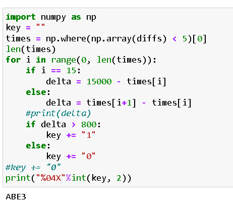
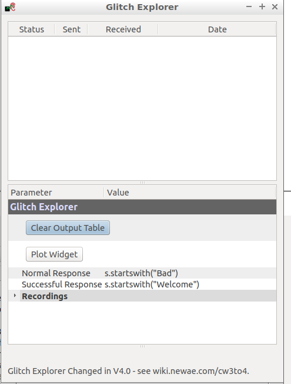

# Lab 5 lab return template 

Name ```Lauri Suutari```

Student ID ```Y57874058 ```

Participated in tasks ```1,2,3 ```


Name ```Mikko Kaasila```

Student ID ```Y57886280 ```

Participated in tasks ```1,2,3 ```


Name ```Juho Bruun```

Student ID ```Y57863656 ```

Participated in tasks ```1,2,3 ```

Name ```Aleksi Tuovinen```

Student ID ```Y57303473 ```

Participated in tasks ```1,2,3 ```

Name ```Mikael Pennanen```

Student ID ```Y57900010 ```

Participated in tasks ```1,2,3 ```

Add all your group member's names and student IDs here. If you continue the tasks at home, you can work with different people. Please mark who participated in which tasks.

# Task 1
### Inspecting power differences of operations

Replace the following screenshot.

It should contain your custom power trace where you execute any amount of nops AND muls. You need to execute atleast 10 lines worth of each command and in total atleast 40 lines worth of assembly code. You are not required to execute the commands in 10 line chuncks and you can execute also any other assembly commands besides nop and mul.

Please have your screenshots roughly in the same scale as the placeholders. If your whole trace doesn't fit to that scale then you can of course take a larger picture.

Remember also add textual descriptions of images if they are needed.

#### Trace with your custom set of operations

*From sample 10 to 300 there are 10 nop, 10 mul, 15 nop, 15 mul instructions*

### Breaking AES

**Paste the screenshot of solved key here**


Explain how the correlation power analysis works. You may use questions given in task as template of your answer.

  First step is to create a model that corresponds to the target machines power consumption. The next step is to record the traces of the power consumption by making the target machine encrypt plaintext files. Third step is to attack subkeys of the secret key. After attacking the subkeys the algorithm will create a full key from the best guesses of the subkeys.
  
  First the corresponding bytes of secret key and plaintext are exclusive or'd (X-OR) that is then submitted to the substitution box (S-BOX). S-BOX takes a certain amount of bits which is then transformed a number of output bits. The output of this S-BOX is what we want to analyze as the sensitive point of attack. In this case we will use the Hamming Weight Power Model, which calculates the number of 1s in binary numbers to determine the Hamming Weight of each binary number. The Hamming Weights will then be used to approximate the power usage of the target machine to capture levels of traces power usage. These traces will then be used to find correlations between the model and the power consumption.
  
  For each bit in a byte of the subkeys we will create a zero array (hyp) of the same size as the number of traces. After this for each element in the array hyp we will calculate the output of the S-Box when inserting a part of the text array and a guess. After the zero array is filled with the output of this, we will calculate the mean for all of the values in the new array and the mean of the values of the array containing the traces. After this we will substract the mean of all the hyp values from each value of the hyp array and do the same for the array of traces with the mean of the array. Which is then used to create the bestguesses.
  
  We managed to find the correct key as the end result, it was completely right.


# Task 2

### Password bypass with power analysis

```

```

Screenshot after your script has correctly solved the password


### Breaking RSA

__Insert your attack script here__
```
import numpy as np
key = ""

times = np.where(np.array(diffs) < 10)[0]

for i in range(0, len(times)-1):
    delta = times[i+1] - times[i]
    if delta > 800:
        key += "1"
    else:
        key += "0"
key += "0"

print("%04X"%int(key, 2))
```

__Sceenshot demonstrating solved keys here__
Here are all the pictures of the process when acquiring the solved key


__You were asked question about solving last bit of key, insert answer here__

```
Theoretically it would be possible to solve the last bit. This could be solved for example by getting a delta time from between the last spike and the point where the offset has balanced. By configuring the base code a bit and having an estimate of the delta time where this balancing happens we can get the last bit as well, but this is not very efficient. 
```


# Task 3

## A) Introduction to clock glitch attacks

**Screenshots of successful glitching of the functions `glitch1()` and `glitch3()`**


## B) Buffer glitch attack


```python
  When line 140 of bootloader.c is changed to volatile int i, there happens minor changes in some registeries which is normal, but also a rmjp to main appears in the middle of the assembly code. This could be used to do a glitch attack on.
```

## C) Differential Fault Analysis on AES

**Paste screenshot of successful results here**



```python
Paste your answers to additional questions here
```

# Task 4

This tasks documentation varies depending on which versio you chose. Create your own documentation as you see fit. List here all the files that are part of your return
