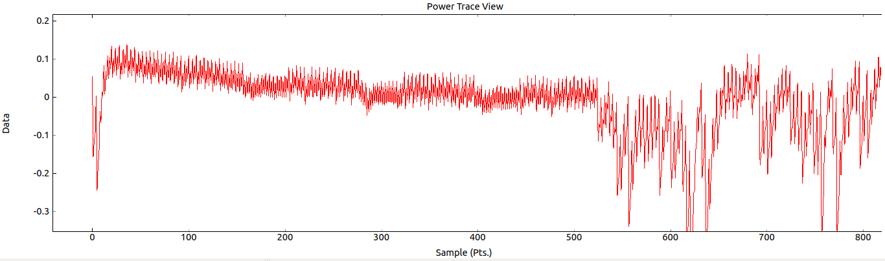
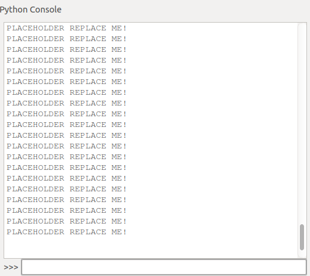
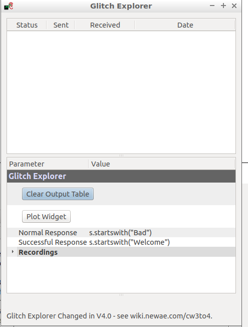

# Lab 5 lab return template 

Name ``` ```

Student ID ``` ```

Participated in tasks ``` ```

...

Name ``` ```

Student ID ``` ```

Participated in tasks ``` ```

Add all your group member's names and student IDs here. If you continue the tasks at home, you can work with different people. Please mark who participated in which tasks.

# Task 1
### Inspecting power differences of operations

Replace the following screenshot.

It should contain your custom power trace where you execute any amount of nops AND muls. You need to execute atleast 10 lines worth of each command and in total atleast 40 lines worth of assembly code. You are not required to execute the commands in 10 line chuncks and you can execute also any other assembly commands besides nop and mul.

Please have your screenshots roughly in the same scale as the placeholders. If your whole trace doesn't fit to that scale then you can of course take a larger picture.

Remember also add textual descriptions of images if they are needed.

#### Trace with your custom set of operations

*Example description: From sample X to Y there executes 10 Z instructions*

### Breaking AES

**Paste the screenshot of solved key here**



Explain how the correlation power analysis works. You may use questions given in task as template of your answer.
```
*insert explanation here*
```

# Task 2

### Password bypass with power analysis

```
Paste your working attack script here
Paste whole script or just the part(s) you modified
```

Screenshot after your script has correctly solved the password


### Breaking RSA

__Insert your attack script here__
```
Paste attack script here
```

__Sceenshot demonstrating solved keys here__


__You were asked question about solving last bit of key, insert answer here__

```
*Insert your answer to question about last key bit here*
```

# Task 3

## A) Introduction to clock glitch attacks

**Screenshots of successful glitching of the functions `glitch1()` and `glitch3()`**


## B) Buffer glitch attack


**Paste the screenshot of successful glitch result here**


```python
Paste your answers to additional questions here
```

## C) Differential Fault Analysis on AES

**Paste screenshot of successful results here**



```python
Paste your answers to additional questions here
```

# Task 4

This tasks documentation varies depending on which versio you chose. Create your own documentation as you see fit. List here all the files that are part of your return
