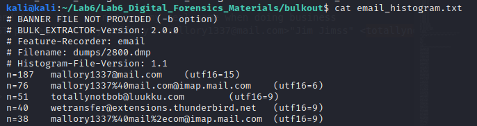
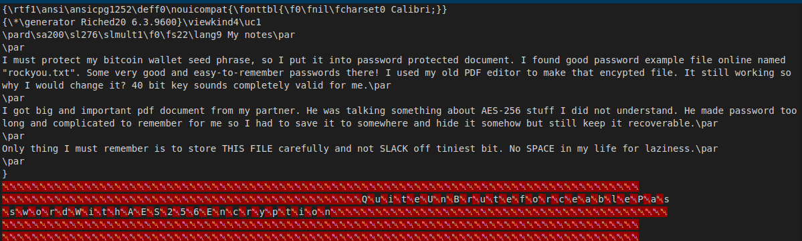
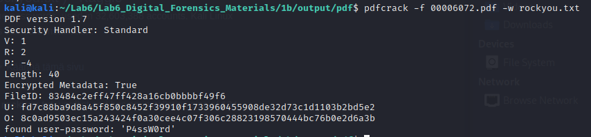
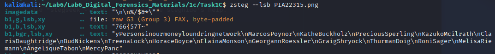
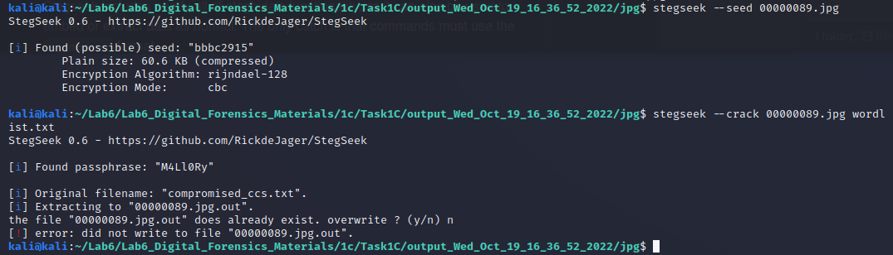

# Lab 6 lab return template 

Name ```Aleksi Tuovinen```

Student ID ```Y57303473```

# Task 1

## A)

Find coordinates of hidden caches from browser and email from volatile memory of the machine. Explain shortly how you achieved the results.

### Flag 1 & 2: LAKE & COAST

Volatility pslist gives the list of running processes. There are four firefox processes running and one explorer instance. Also a firebird process can be seen. Using volatility and memdumping the executables into different dumps. Running yarascan with -Y "google.com/maps/" flag gives out plenty of maps places.

```
LAKE: 
Coordinates: 65.1281308 N 25.7003738 E
Location: Nurmijärvi
```
By going through the map placement the accused was looking through Nurmijärvi is the closes one to a lake. Also by scraping the Mozilla executable for files provided pictures of accused looking at Nurmijärvi

```
COAST:
Coordinates: 64.990494 N 25.2950852 E
Location: Somewhere near Varjakan saari between Akionlahti and Varjakansaari
```
A lot of the coordinates the accused went through pointed to this spot.

### Flag 3: FOREST

Dismantling the firebird process into files nets a large sum of pictures along with one picture of a forest somewhere. Using bulk extractor to get a lot of stuff out nets us a histogram of email words where one email called **totallynotbob@luukku.com** pops up.



Little more digging nets an interesting email conversation where Mallory says the following

```
Subject:
FOREST package
Hey, your drop is ready to be picked up from FOREST. I hid stash under the rightmost tree you can see in the image I attached for you.
```

Now we just take a look at the forest picture exif data and. . .

```
Forest:
Coordinates: 64° 55' 5.07" N, 25° 37' 9.54" E
Location: Tahkoseläntie, Kempele
```

## B)

Find 2 PDF files and insert the unencrypted content of them below.

Explain shortly how you achieved your results (how you carved files, how you found decryption passwords for PDFs etc)

### Flag 1: Content of PDF-document 1
```
My seed phrase:
witch collapse practice feed shame open despair creek road again ice least
```

### Flag 2: Content of PDF-document 2
```
Bank account numbers of my trusted partners
AD3324908418606428574517
AD0528103825874066719436
AD0994570012215151921531
AD7879216119408349308517
AD5763190012310107389367
AD4049555226571487107204
AD3823628354195777933785
AD4821523727224250168062
AD3787241979262430024695
```

Using scalpel with a the preconf file that had these two lines nets the pdf files and the rtf files. Obviously had to uncomment the pdf and give them bit more bits to get both out just fine. 

```
RTF                                 y    2500000    \x7b\x5c\x72\x74\x66
RTF                                 y    2500000    \x7b\x5c\x72\x74\x66\x31    \x5c\x70\x61\x72\x20\x7d\x7d
```

Checking the rtf we get basically everything we need (yes this is opened in VSC shut up)



Then just roll the rockyou.txt with pdfcrack and get the second file open.



## C)

### Flag 1 & 2: 2 simply hidden short messages

```
PIA23044.jpg
meetmeatharbourtomorrow2300
```

Found through strings command.

```
PIA22810.jpg
bmV4dHBhY2thZ2VFVEExMGRheXM=
nextpackageETA10days
```

Base64 string found with strings.

### Flag 3: More sophisticated hiding
```
PIA22315.png
"yPersonsinourmoneyloundringnetwork\nMarcosPoynor\nKatheBuckholz\nPreciousSperling\nKazukoMcilrath\nClarisDaughtridge\nBudNickens\nTreenaLock\nHoraceBoyce\nElainaMonson\nGeorgannRoessler\nGraigShryock\nThurmanDoig\nRoniSager\nMelisaRiemann\nAngeliqueTabon\nMercyPanc"
```

Found with zsteg.



### Flag 4: Hiding with 2 different techniques
```
PIA22912.jpg
Visa4916409256829225
Visa4716029657137259
Visa4716387863149421
Visa4485445796907296
Visa4929450529020619
Visa4929061069341420
Visa4556244788903494
Visa4859792997820952
Visa4024007116210948
Visa4539017996993719
rest omitted due to large file
```

When I was searching for the plaintexts using strings I noticed that **PIA22912.jpg** had another jpg hidden inside it. With foremost extracting the jpg was easy, and it was actually quite large file too. 

Then using a program called *stegseek* I first bruteforced it to see if anything was hidden inside it, and indeed, there was something inside it. Using a quick and dirty python script that created different mallory passwords and then using stegseek to crack it with a wordlist netted the Visa results.




# Task 2

```
*Insert your analysis of DDoS attack here or make your custom documentation as you see fit.*
*Make sure your analysis fulfills all requirements specified in task instructions*
```

### Flag: Hypothetical IP address of the person behind the attack
```
*Insert ip address and explain why you came to that conclusion*
```
